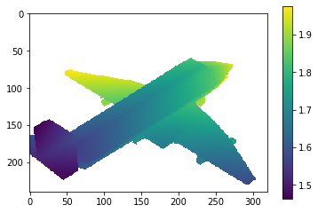

# mesh-to-depth

Depth map generator written in C++ and Python. CPU-only.

Multi-layer depth map implementation **comping soon** (see [3D Scene Reconstruction with Multi-layer Depth and Epipolar Transformers](https://research.dshin.org/iccv19/multi-layer-depth/), ICCV 2019).

## Install

Only tested on Python 3.6-3.8 on Ubuntu 18.04.

```bash
# Make sure pip is up to date: pip install -U pip
pip install mesh-to-depth
```

For other python versions and distributions,  you may have to compile from source.
See [this page](https://pypi.org/project/mesh-to-depth/#files) for supported precompiled binaries.

## Example

```python
import numpy as np
import mesh_to_depth as m2d

params = []

params.append({
    'cam_pos': [1, 1, 1], 'cam_lookat': [0, 0, 0], 'cam_up': [0, 1, 0],
    'x_fov': 0.349,  # End-to-end field of view in radians
    'near': 0.1, 'far': 10,
    'height': 240, 'width': 320,
    'is_depth': True,  # If false, output a ray displacement map, i.e. from the mesh surface to the camera center.
})
# Append more camera parameters if you want batch processing.

# Load triangle mesh data. See python/resources/airplane/models/model_normalized.obj
vertices = ...  # An array of shape (num_vertices, 3) and type np.float32.
faces = ...  # An array of shape (num_faces, 3) and type np.uint32.

depth_maps = m2d.mesh2depth(vertices, faces, params, empty_pixel_value=np.nan)
```

Visualize:

```python
import matplotlib.pyplot as pt

pt.imshow(depth_maps[0], interpolation='none')
pt.colorbar()
```



See also: [python/tests](python/tests/test_depth_generation.py)

## Test

### Manual

Requires `pytest`.

```bash
git clone --recurse-submodules https://github.com/daeyun/mesh_to_depth
cd mesh_to_depth
```

Then either build the `.so` files with `bash ./cpp/scripts/build_all.sh` or do `pip install -e .`. Then run rests:

```bash
cd python
pytest ./tests
```

### Automatic

```
pip install tox
git clone --recurse-submodules https://github.com/daeyun/mesh_to_depth
cd mesh_to_depth
tox
```
